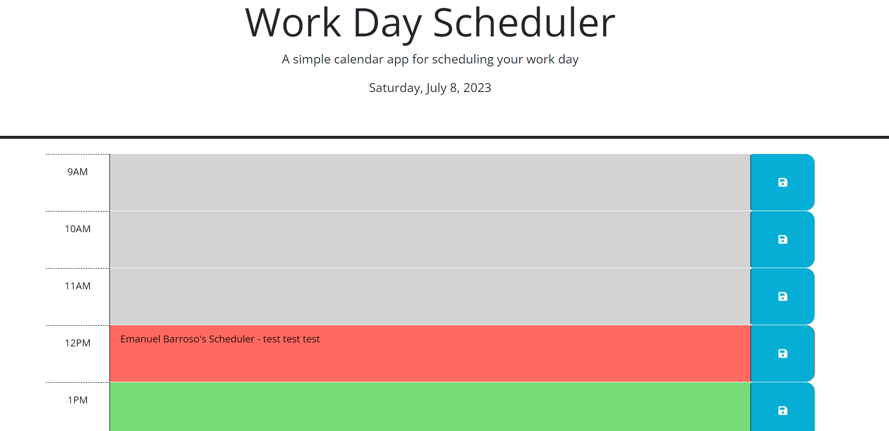

# API-challenge-5
# <"A useful daily scheduler app using local storage to save entries">

## Description

- What was your motivation? The purpose of this project was to use the starter code provided to create a functioning time scheduler app. This app would allow the user to save daily tasks on a normal 9am to 5pm work day. This app is color coded to reflect the past, present, and future times during the user's work hours, and it is color coded, which will update depending on the user's time zone. This app was made with the intention of making a useful scheduling tool so that the user can log their daily tasks, and it is simple to use.

## Table of Contents

- [Usage](#usage)
- [Credits](#credits)
- [License](#license)


## Usage

This daily scheduler uses Dayjs to use the user's local time to refresh the scheduler. Color coding was implemented in the app to reflect past, present, and future times, which makes for an easier to follow user interface. The user is able to input text in the corresponding time blocks, then click on the blue box next to the time block to save the text entry. The user can input text in the time blocks (from 9am to 5pm, typical work day), and save them in local storage. This allows the text entries to be saved, even when the page is refreshed. Here is a screenshot of what the scheduler would look like on a 9am to 5pm time frame: . 
    ```

## Credits

YouTube - Design2Day: https://www.youtube.com/watch?v=YPU6gOctNvM
Mozila.org: https://developer.mozilla.org/en-US/docs/Web/API/Window/localStorage
Stackoverfow.com: https://stackoverflow.com/questions/73565932/i-have-added-a-local-storage-function-but-it-doesnt-seem-to-work-on-my-scheduler
Chatgpt.com: https://chat.openai.com/

## License
MIT License

Copyright (c) 2023 ebarroso24